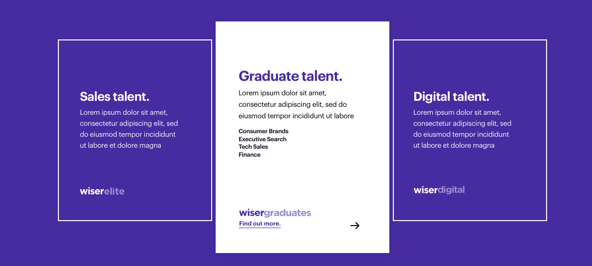

# Junior Front End Engineer Task

# About this task

This task should be completed to be considered for the Junior Front End Engineer position at Wiser. The task will focus purely on writing HTML and SASS, as this will be a significant part of your role should you be successful.

# Instructions

Fork this repo, and clone a copy onto your local machine. When you have completed the task, push your code and email us a link to your fork at engineering@wearewiser.com. You should spend no more than 2 hours on this task.

# The task

This screenshot below has been taken from a web design put together by the design team here at Wiser. The aim of this task is to replicate this design as accurately as possible by writing HTML and SASS.

- Each box should have a hover state which increases the scale, changes the background and reveals additional text (the revealed text can be the same on each box).
- Feel free to create a new component if you wish, otherwise use the app.component files already in the repo.
- Build a desktop version only, don't worry about responsive design
- Don't worry about changing the font
- The colours should match the design, although it doesn't need to be perfect

Bonus task:

- Animate the transition to and from the hover state for a better user experience
